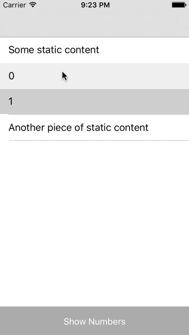

# DynamicTableInStaticTable
An example of how UITableViewController can be used with static cells to keep simple references to static outlets even if some part of it must be changable dynamically.
To make things evem more complicated dynamic cells can be not only added and deleted, but also rearranged with [BVReorderTableView](https://github.com/bvogelzang/BVReorderTableView).
And another bit of complication: we want to have some view at the bottom of the screen, which doesn't move as table scrolls, but can do something with table's content.
Latter solved with help of [YoCoh's answer](http://stackoverflow.com/a/27724293/2260054)

**Conclusion**: never ever add subviews to UITableViewController's view, and never use dynamic cells prototypes to present static content, there are other more reliable ways to achieve the same.
